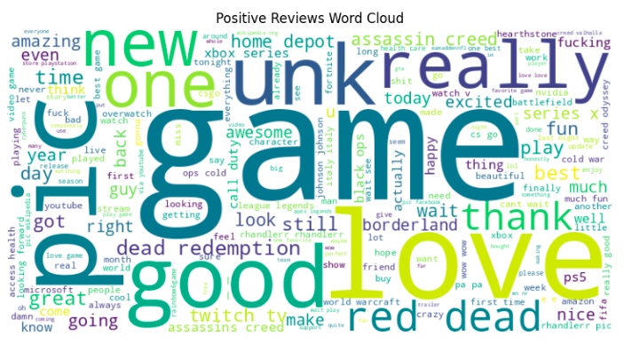
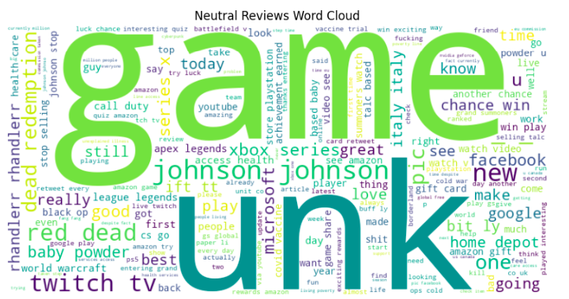
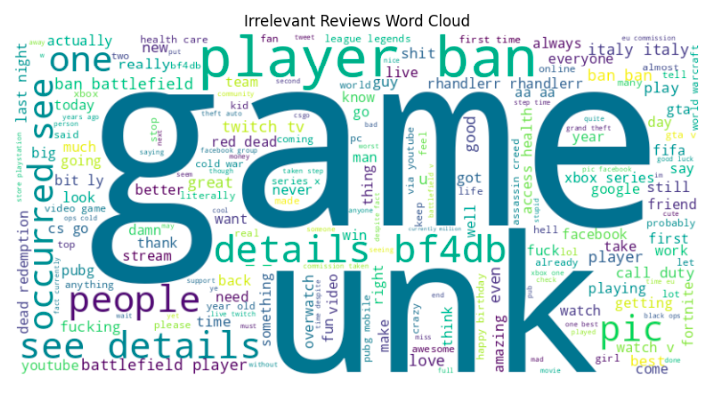

# twitter-sentiment-analysis
Using Word2Vec model to conduct sentiment analysis on X (formerly twitter) tweets and visualizing the results.

The following results were obtained on the test data:

### Positive Words Word Cloud

### Neutral Words Word Cloud

### Irrelevant Words Word Cloud

